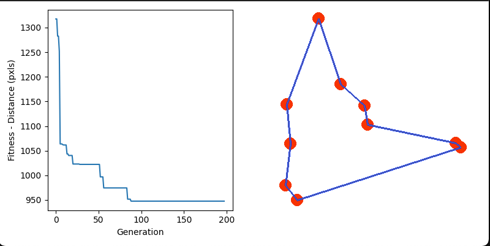

# Tech Challenge Fase 2 — Otimização de Rotas Médicas

Sistema de otimização de rotas para distribuição de medicamentos e insumos hospitalares, usando **Algoritmo Genético (VRP)** e **LLM (Groq)** para relatórios, instruções e chat operacional.



## O que o projeto faz

1. Otimiza rotas de entrega com Algoritmo Genético
2. Considera **prioridades**, **capacidade** e **autonomia por veículo**
3. Simula a evolução em tempo real (Pygame)
4. Gera **análise**, **relatório diário**, **instruções** e **chat** com IA
5. Abre painel operacional com abas (mapa, veículos, relatório, chat)

## Pré-requisitos

- [Anaconda](https://www.anaconda.com/download) ou Miniconda
- Conta Groq com API key ([console.groq.com](https://console.groq.com))

## Instalação

```bash
conda env create --file environment.yml
conda activate fiap_tsp
```

Crie um arquivo `.env` na raiz do projeto:

```env
GROQ_API_KEY=sua_chave_aqui
```

## Como executar

```bash
python tsp.py
```

- Pressione **Q** ou feche a janela para encerrar a simulação
- Ao final, o painel com abas abre automaticamente
- Resultados salvos localmente em `melhor_rota.txt` (não vai para o Git)

## Testes automatizados

```bash
pytest tests/ -v
```

## Estrutura do projeto

```
genetic_algorithm.py   # AG, fitness VRP, restrições
tsp.py                 # Simulação principal
dashboard_ui.py        # Painel com abas e chat
draw_functions.py      # Desenho Pygame
groq_analysis.py       # Análise técnica (LLM)
groq_relatorio.py      # Relatório operacional diário (LLM)
groq_rotas.py          # Instruções de entrega (LLM)
groq_perguntas.py      # Chat em linguagem natural (LLM)
tests/                 # Testes automatizados
docs/                  # Arquitetura e avaliação da LLM
```

## Configuração

Em `genetic_algorithm.py`:

| Parâmetro | Padrão | Descrição |
|-----------|--------|-----------|
| `NUM_VEICULOS` | 3 | Quantidade de veículos |
| `CAPACIDADE_VEICULO` | 400 | Carga máxima por veículo |
| `DISTANCIA_MAXIMA_VEICULO` | 9000 | Autonomia por veículo |

Em `tsp.py`:

| Parâmetro | Padrão | Descrição |
|-----------|--------|-----------|
| `N_CITIES` | 10 | Cidades (use 10, 12 ou 15) |
| `POPULATION_SIZE` | 100 | Tamanho da população |
| `N_GENERATIONS` | 1000 | Gerações máximas |
| `MUTATION_PROBABILITY` | 0.5 | Taxa de mutação |

Para usar o benchmark ATT48 (48 cidades), descomente o bloco correspondente em `tsp.py`.

## Documentação adicional

- [Arquitetura e diagrama](docs/ARQUITETURA.md)
- [Avaliação da qualidade da LLM](docs/AVALIACAO_LLM.md)

## Relação com o Tech Challenge (PDF Fase 2)

| Requisito | Status |
|-----------|--------|
| AG para roteamento com restrições | Implementado |
| Visualização em mapa | Pygame + painel |
| LLM: instruções, relatório, melhorias | Implementado |
| Chat em linguagem natural | Implementado |
| Testes automatizados | `tests/` |
| Documentação e diagrama | `docs/` |
| Relatório técnico (documento) | A entregar pelo grupo |
| Vídeo demonstração | A gravar pelo grupo |

## Licença

[MIT License](LICENSE)
