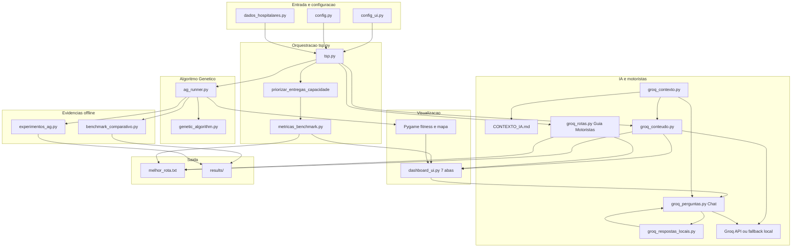
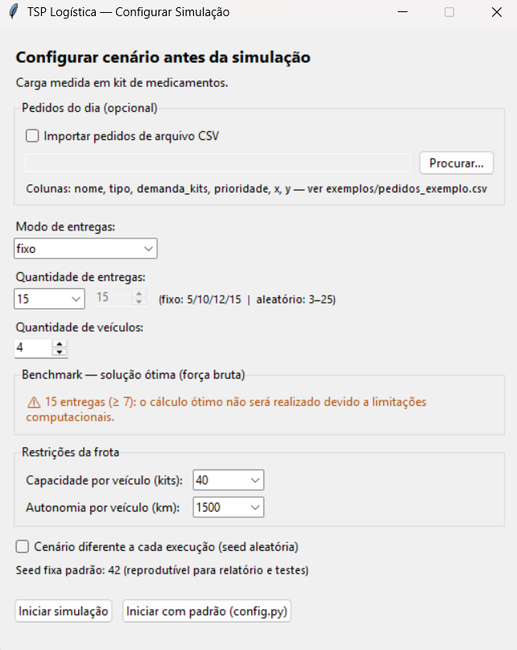
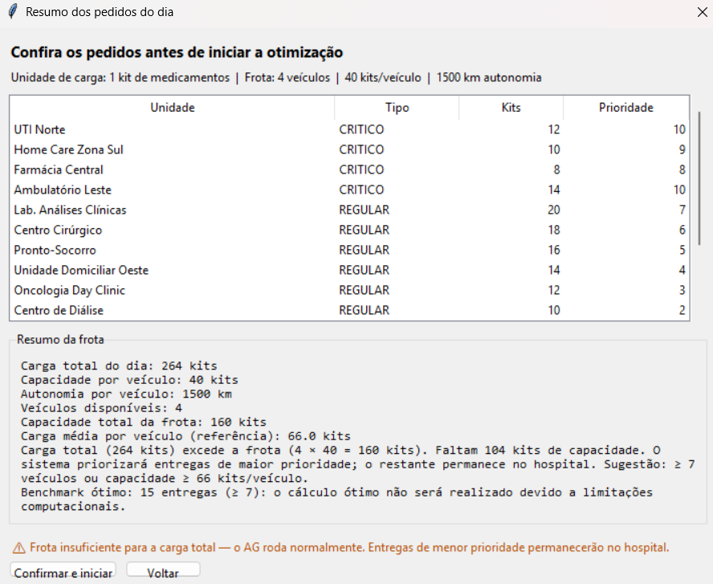
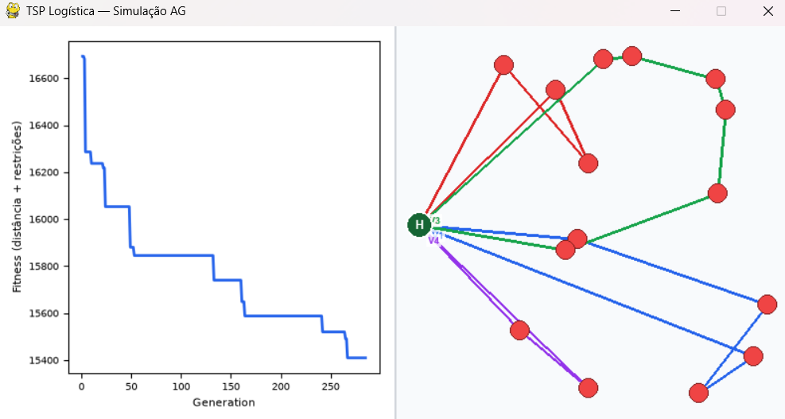
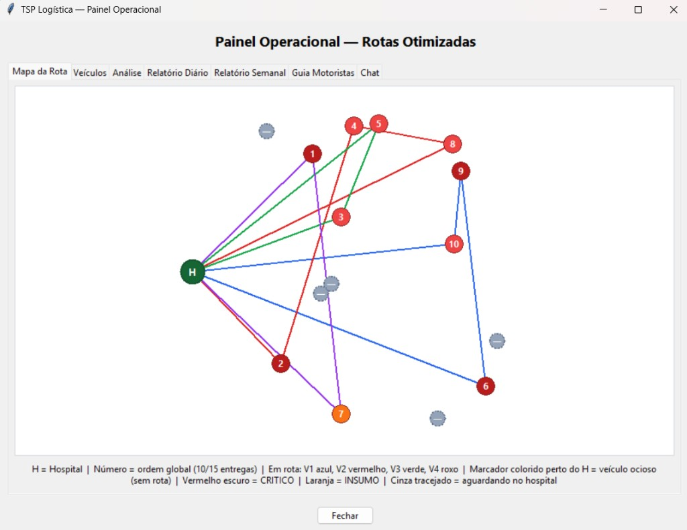

# Tech Challenge Fase 2 — Otimização de Rotas Médicas

Sistema de **roteirização hospitalar (VRP)** para distribuição de medicamentos e insumos, com **Algoritmo Genético**, **LLM (Groq)** para análise/relatórios/chat e **guia para motoristas** montado localmente.

## Unidade de carga

Toda demanda e capacidade usam a mesma unidade:

> **1 unidade = 1 kit de medicamentos** (caixa/kits fechados pela farmácia hospitalar)

No **modo fixo**, demandas e prioridades por unidade são **tabelas fixas** (reprodutíveis — não mudam com a seed). No **modo aleatório**, kits e prioridade são sorteados por tipo conforme a seed.

## O que o projeto faz

1. Otimiza rotas de entrega com Algoritmo Genético (múltiplos veículos, depósito hospitalar)
2. Considera **prioridades**, **capacidade (kits)**, **autonomia**, **depósito hospitalar** e **tipos de entrega** (CRITICO, REGULAR, INSUMO)
3. **Prioriza kits de maior prioridade** quando a frota não comporta toda a demanda — o excedente **permanece no hospital** e é reportado
4. Usa **nomes reais de unidades hospitalares** (UTI, Home Care, Farmácia, etc.)
5. Exibe **resumo dos pedidos** antes de rodar (unidade · tipo · kits · prioridade)
6. Simula a evolução em tempo real (Pygame)
7. Gera **análise**, **relatórios**, **guia motoristas** e **chat**
8. Abre painel operacional com 7 abas (mapa, veículos, análise, relatórios, guia motoristas, chat)

## Arquitetura

Fluxo principal do sistema:



- **Groq:** 1 chamada para análise + relatórios (`groq_conteudo.py`)
- **Guia Motoristas:** montado localmente (`groq_rotas.py`)
- **Chat:** respostas locais primeiro (`groq_respostas_locais.py`), depois Groq se necessário

Detalhes dos módulos: [docs/ARQUITETURA.md](docs/ARQUITETURA.md)

## Pré-requisitos

- [Anaconda](https://www.anaconda.com/download) ou Miniconda
- Conta Groq com API key ([console.groq.com](https://console.groq.com))

## Instalação

```bash
conda env create --file environment.yml
conda activate vrp_hospitalar
```

Crie um arquivo `.env` na raiz do projeto:

```env
GROQ_API_KEY=sua_chave_aqui
# Opcional:
# GROQ_MODEL=llama-3.1-8b-instant
# GROQ_DESABILITADO=1
```

| Variável | Descrição |
|----------|-----------|
| `GROQ_API_KEY` | Obrigatória para IA via Groq |
| `GROQ_MODEL` | Modelo (padrão: `llama-3.1-8b-instant`; ex.: `llama-3.3-70b-versatile`) |
| `GROQ_DESABILITADO=1` | Pula a API e usa textos locais (demo offline) |

Se a cota diária da Groq esgotar (erro 429), o sistema **não interrompe** — gera análise e relatórios localmente, monta o guia motoristas e abre o painel normalmente. Nova chave API na **mesma conta** compartilha a mesma cota.

## Como executar

```bash
python tsp.py
```

> `tsp.py` é o ponto de entrada do fluxo VRP hospitalar (nome histórico do arquivo principal).

Fluxo completo:

```
Configuração → Resumo dos pedidos → Pygame (AG) → Painel + IA
```

### 1. Janela de configuração



| Campo | Opções | Descrição |
|-------|--------|-----------|
| **Modo de entregas** | `fixo` / `aleatorio` | Fixo usa unidades hospitalares pré-definidas; aleatório gera coordenadas |
| **Quantidade de entregas** | Fixo: 5, 10, 12 ou 15 · Aleatório: 3–25 | Número de paradas na rota |
| **Quantidade de veículos** | 2 a 8 | Frota disponível; excedentes permanecem no hospital (sem rota) |
| **Capacidade por veículo** | 40 / 60 / 80 kits | Limite de carga por van |
| **Autonomia por veículo** | 1200 / 1500 / 2000 km | Distância máxima por rota |
| **Importar CSV** | opcional | Pedidos do dia — ver [`exemplos/pedidos_exemplo.csv`](exemplos/pedidos_exemplo.csv) |
| **Cenário diferente** | checkbox | Seed aleatória a cada execução |
| **Benchmark — solução ótima** | painel dinâmico | Aviso se ótimo (força bruta) será omitido: **≥ 7 entregas** ou **> 6 veículos** |
| **Iniciar simulação** | botão | Abre resumo dos pedidos → confirma → roda o AG |
| **Iniciar com padrão (config.py)** | botão | Carrega valores padrão do arquivo |

**Mesma rota sempre?** Com a mesma seed e os mesmos parâmetros, sim — resultado reprodutível. Marque **Cenário diferente** ou altere parâmetros para variar.

**Viabilidade da frota:** o resumo avisa se a carga total (kits) excede `veículos × capacidade`. O AG roda normalmente; após a otimização, **entregas de menor prioridade permanecem no Hospital Central** (relatórios, chat e `melhor_rota.txt` listam os remanescentes). Veículos **nunca excedem capacidade** na operação efetiva. Quando a frota é insuficiente, **cada veículo em operação é carregado ao máximo** antes de deixar kits remanescentes no hospital.

### 2. Resumo dos pedidos (antes do AG)



Tabela com todos os pedidos do dia, carga total, capacidade da frota e aviso se a frota é insuficiente.

### 3. Simulação Pygame (AG em tempo real)



Gráfico de fitness à esquerda; mapa com depósito **H**, rotas coloridas por veículo e marcadores **V{n}** para vans ociosas no hospital. Durante o AG o mapa evolui; o **último frame** exibe as rotas finais pós-priorização (igual ao dashboard), com label **V1**, **V4**, etc. nas linhas ativas. Pressione **Q** ou feche a janela para encerrar.

### 4. Painel operacional (após a simulação)



Abas: mapa, veículos, **análise** (métricas do AG + comparativo com aleatória, vizinho mais próximo, greedy e ótimo quando viável + interpretação da IA), relatórios diário/semanal, **guia motoristas** (rota passo a passo por veículo) e chat. O cabeçalho mostra apenas o título — sem bloco de resumo no topo. A **convergência** do AG aparece só na simulação **Pygame** (gráfico à esquerda), não no painel. No mapa, **nós numerados** = entregas efetivas; **nós cinza tracejados (—)** = kits que ficaram no hospital por falta de capacidade; **marcadores coloridos perto do H (V1, V2…)** = veículos ociosos sem rota nesta execução. Resultados salvos em `melhor_rota.txt` (local, não vai para o Git): rotas por veículo, remanescentes e bloco de **métricas comparativas** (mesmo conteúdo da aba Análise).

### Pedidos via CSV (opcional)

```csv
nome,tipo,demanda_kits,prioridade,x,y
UTI Norte,CRITICO,12,10,733,251
Farmácia Central,REGULAR,18,6,546,97
```

Marque **Importar pedidos de arquivo CSV** na janela de configuração.

### Scripts sem interface (benchmarks)

```bash
python benchmark_comparativo.py   # AG vs heurísticas → results/
python experimentos_ag.py         # 3 configs do AG → results/
```

Usam apenas `config.py` (sem janela gráfica).

## Testes automatizados

```bash
py -m pytest tests/test_projeto.py -v
```

**88 testes** — config, modo fixo, AG/VRP, chat local, dashboard, IA (fallback) e regressão de bugs de demo.

Guia do que cada teste faz: [`tests/README.md`](tests/README.md)  
Cenários reutilizáveis (modo fixo vs textos simulados): [`tests/fixtures_dados.py`](tests/fixtures_dados.py)

## Estrutura do projeto

```
config.py              # Parâmetros padrão, unidade de carga, opções de frota
config_ui.py           # Janela de config + resumo de pedidos
dados_hospitalares.py  # Nomes, tipos, demandas, CSV, viabilidade, priorização por capacidade
genetic_algorithm.py   # AG, fitness VRP, restrições, depósito
ag_runner.py           # Execução do AG (reutilizável)
heuristics.py          # Heurísticas para comparativo
metricas_benchmark.py  # Métricas AG vs heurísticas vs ótimo (aba Análise)
benchmark_comparativo.py
experimentos_ag.py
tsp.py                 # Ponto de entrada — orquestra simulação VRP + painel
dashboard_ui.py        # Painel com 7 abas (cabeçalho enxuto) e chat
draw_functions.py      # Pygame (gráfico + mapa)
groq_conteudo.py       # Análise + relatórios (1 chamada API, 3 seções)
groq_rotas.py          # Guia Motoristas — rota passo a passo (local)
groq_contexto.py       # Carrega docs/CONTEXTO_IA.md nos prompts
groq_utils.py          # Cliente Groq, fallback e .env
groq_respostas_locais.py # Respostas locais do chat
groq_*.py              # Fallbacks por módulo
exemplos/              # CSV de exemplo + capturas de tela do fluxo
tests/                 # Suite de testes (ver tests/README.md)
docs/
  VISAO_GERAL_SISTEMA.md   # Visão do sistema para a equipe
  ARQUITETURA.md           # Diagrama e módulos
  EVIDENCIAS_EXPERIMENTAIS.md  # Benchmarks e relatório técnico
  CONTEXTO_IA.md           # Regras fixas nos prompts Groq (não é doc de leitura)
results/               # Gerado localmente (gitignored)
```

## Configuração (`config.py`)

Parâmetros técnicos e padrões da janela. Obrigatório para scripts de benchmark.

| Parâmetro | Padrão | Descrição |
|-----------|--------|-----------|
| `UNIDADE_MEDIDA` | kit de medicamentos | Unidade de demanda e capacidade |
| `N_CIDADES` | 15 | Entregas hospitalares (padrão da janela) |
| `MODO_CIDADES` | `"fixo"` | `"fixo"` (5/10/12/15) ou `"aleatorio"` |
| `DEPOT` | `(400, 200)` | Depósito hospitalar |
| `NUM_VEICULOS` | 4 | Veículos (padrão da janela) |
| `CAPACIDADE_VEICULO` | 40 | Kits por veículo (padrão) |
| `OPCOES_CAPACIDADE` | 40, 60, 80 | Opções na janela |
| `DISTANCIA_MAXIMA_VEICULO` | 1500 | Autonomia km (padrão) |
| `OPCOES_AUTONOMIA` | 1200, 1500, 2000 | Opções na janela |
| `SEED` | 42 | Seed reprodutível |
| `LIMITE_CIDADES_BENCHMARK` | 7 | A partir de 7 entregas, ótimo (força bruta) é omitido |

### Métricas na aba Análise (painel)

Após cada simulação, o painel exibe:

| Grupo | Métricas |
|-------|----------|
| **AG** | Fitness inicial/final, distância inicial/final, melhoria %, geração de convergência |
| **Comparativo (km)** | AG, rota aleatória, vizinho mais próximo, greedy por prioridade, ótimo VRP* |
| **Relativo ao AG** | Economia em km e % vs cada método; diferença vs ótimo quando calculado |

O mesmo bloco é gravado em `melhor_rota.txt` ao final de cada simulação (`python tsp.py`).

\*Ótimo só com **≤ 6 entregas**, **≤ 6 veículos** e veículos ≤ entregas. Script completo: `python benchmark_comparativo.py`.

## Documentação

- [Arquitetura e diagrama](docs/ARQUITETURA.md) — versão detalhada do diagrama acima
- [Visão geral do sistema](docs/VISAO_GERAL_SISTEMA.md) — fluxo, módulos e checklist da equipe
- [Evidências experimentais](docs/EVIDENCIAS_EXPERIMENTAIS.md) — benchmarks, relatório técnico e demo da LLM

O arquivo `docs/CONTEXTO_IA.md` é carregado automaticamente nos prompts da Groq (`groq_contexto.py`); edite-o para ajustar regras da IA, não como documentação de usuário.

## Relação com o Tech Challenge (PDF Fase 2)

| Requisito | Status |
|-----------|--------|
| AG para roteamento com restrições | Implementado |
| Depósito hospitalar | Implementado |
| Nomes e tipos de entrega hospitalar | `dados_hospitalares.py` |
| Unidade de carga e demandas configuráveis | kits + tabela fixa + CSV |
| Comparativo com outras abordagens | `benchmark_comparativo.py` |
| 3 experimentos com configs do AG | `experimentos_ag.py` |
| Visualização em mapa | Pygame + painel |
| LLM: instruções, relatórios, melhorias | Análise/relatórios via Groq; guia motoristas local |
| Chat em linguagem natural | Implementado |
| Configuração interativa + resumo de pedidos | `config_ui.py` |
| Testes automatizados | `tests/test_projeto.py` (88) — ver `tests/README.md` |
| Documentação e diagrama | `docs/` |
| Relatório técnico / vídeo demo | A entregar pelo grupo |

## Licença

[MIT License](LICENSE)
