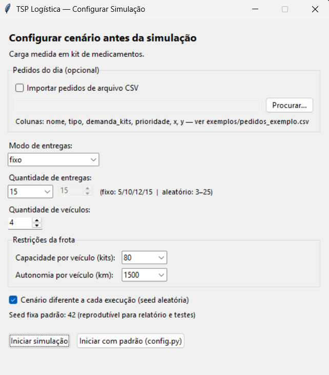
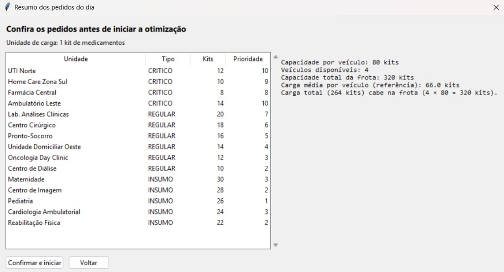
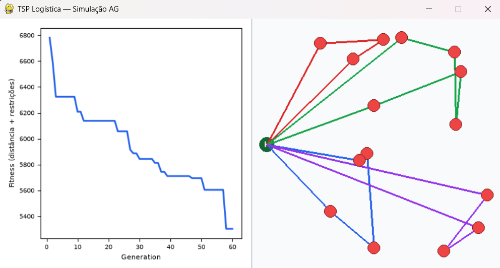
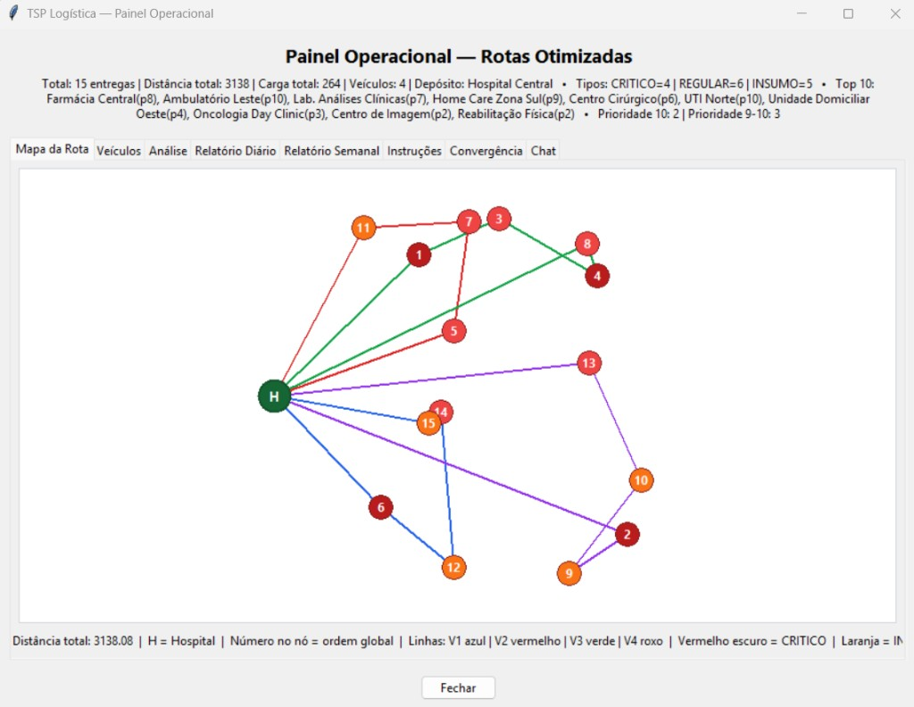

# Tech Challenge Fase 2 — Otimização de Rotas Médicas

Sistema de otimização de rotas para distribuição de medicamentos e insumos hospitalares, usando **Algoritmo Genético (VRP)** e **LLM (Groq)** para relatórios, instruções e chat operacional.

## Unidade de carga

Toda demanda e capacidade usam a mesma unidade:

> **1 unidade = 1 kit de medicamentos** (caixa/kits fechados pela farmácia hospitalar)

No **modo fixo**, demandas e prioridades por unidade são **tabelas fixas** (reprodutíveis — não mudam com a seed). No **modo aleatório**, kits e prioridade são sorteados por tipo conforme a seed.

## O que o projeto faz

1. Otimiza rotas de entrega com Algoritmo Genético
2. Considera **prioridades**, **capacidade (kits)**, **autonomia**, **depósito hospitalar** e **tipos de entrega** (CRITICO, REGULAR, INSUMO)
3. Usa **nomes reais de unidades hospitalares** (UTI, Home Care, Farmácia, etc.)
4. Exibe **resumo dos pedidos** antes de rodar (unidade · tipo · kits · prioridade)
5. Simula a evolução em tempo real (Pygame)
6. Gera **análise**, **relatórios**, **instruções** e **chat** com IA
7. Abre painel operacional com abas (mapa com H = hospital, veículos, chat)

## Pré-requisitos

- [Anaconda](https://www.anaconda.com/download) ou Miniconda
- Conta Groq com API key ([console.groq.com](https://console.groq.com))

## Instalação

```bash
conda env create --file environment.yml
conda activate fiap_tsp
```

Crie um arquivo `.env` na raiz do projeto:

```env
GROQ_API_KEY=sua_chave_aqui
# Opcional:
# GROQ_MODEL=llama-3.1-8b-instant
# GROQ_DESABILITADO=1
```

| Variável | Descrição |
|----------|-----------|
| `GROQ_API_KEY` | Obrigatória para IA via Groq |
| `GROQ_MODEL` | Modelo (padrão: `llama-3.1-8b-instant`; ex.: `llama-3.3-70b-versatile`) |
| `GROQ_DESABILITADO=1` | Pula a API e usa textos locais (demo offline) |

Se a cota diária da Groq esgotar (erro 429), o sistema **não interrompe** — gera análise, relatórios e instruções localmente e abre o painel normalmente. Nova chave API na **mesma conta** compartilha a mesma cota.

## Como executar

```bash
python tsp.py
```

Fluxo completo:

```
Configuração → Resumo dos pedidos → Pygame (AG) → Painel + IA
```

### 1. Janela de configuração



| Campo | Opções | Descrição |
|-------|--------|-----------|
| **Modo de entregas** | `fixo` / `aleatorio` | Fixo usa unidades hospitalares pré-definidas; aleatório gera coordenadas |
| **Quantidade de entregas** | Fixo: 5, 10, 12 ou 15 · Aleatório: 3–25 | Número de paradas na rota |
| **Quantidade de veículos** | 2 a 8 | Frota disponível (não pode ser maior que entregas) |
| **Capacidade por veículo** | 40 / 60 / 80 kits | Limite de carga por van |
| **Autonomia por veículo** | 1200 / 1500 / 2000 km | Distância máxima por rota |
| **Importar CSV** | opcional | Pedidos do dia — ver [`exemplos/pedidos_exemplo.csv`](exemplos/pedidos_exemplo.csv) |
| **Cenário diferente** | checkbox | Seed aleatória a cada execução |
| **Iniciar simulação** | botão | Abre resumo dos pedidos → confirma → roda o AG |
| **Iniciar com padrão (config.py)** | botão | Carrega valores padrão do arquivo |

**Mesma rota sempre?** Com a mesma seed e os mesmos parâmetros, sim — resultado reprodutível. Marque **Cenário diferente** ou altere parâmetros para variar.

**Viabilidade da frota:** o resumo avisa se a carga total (kits) excede `veículos × capacidade` — o AG ainda roda, mas veículos podem aparecer “com restrição”.

### 2. Resumo dos pedidos (antes do AG)



Tabela com todos os pedidos do dia, carga total, capacidade da frota e aviso se a frota é insuficiente.

### 3. Simulação Pygame (AG em tempo real)



Gráfico de fitness à esquerda; mapa com depósito **H** e rotas coloridas por veículo à direita. Pressione **Q** ou feche a janela para encerrar.

### 4. Painel operacional (após a simulação)



Abas: mapa, veículos, análise, relatórios, instruções, convergência e chat. Resultados salvos em `melhor_rota.txt` (local, não vai para o Git).

### Pedidos via CSV (opcional)

```csv
nome,tipo,demanda_kits,prioridade,x,y
UTI Norte,CRITICO,12,10,733,251
Farmácia Central,REGULAR,18,6,546,97
```

Marque **Importar pedidos de arquivo CSV** na janela de configuração.

### Scripts sem interface (benchmarks)

```bash
python benchmark_comparativo.py   # AG vs heurísticas → results/
python experimentos_ag.py         # 3 configs do AG → results/
```

Usam apenas `config.py` (sem janela gráfica).

## Testes automatizados

```bash
pytest tests/test_projeto.py -v
# ou
python tests/test_projeto.py
```

**53 testes** em um único arquivo — config, AG/VRP, IA (Groq) e **regressão de bugs de demo**.

## Estrutura do projeto

```
config.py              # Parâmetros padrão, unidade de carga, opções de frota
config_ui.py           # Janela de config + resumo de pedidos
dados_hospitalares.py  # Nomes, tipos, demandas fixas, CSV, viabilidade
genetic_algorithm.py   # AG, fitness VRP, restrições, depósito
ag_runner.py           # Execução do AG (reutilizável)
heuristics.py          # Heurísticas para comparativo
benchmark_comparativo.py
experimentos_ag.py
tsp.py                 # Fluxo principal
dashboard_ui.py        # Painel com abas e chat
draw_functions.py      # Pygame (gráfico + mapa)
groq_conteudo.py      # Gera análise + relatórios + instruções (1 chamada API)
groq_contexto.py      # Carrega docs/CONTEXTO_IA.md
groq_utils.py         # Cliente Groq, fallback e .env
groq_*.py             # Módulos LLM (análise, relatórios, chat)
docs/CONTEXTO_IA.md   # Contexto fixo para a IA (chat e relatórios)
exemplos/              # CSV de exemplo
tests/test_projeto.py  # Testes unitários (53) + validadores_ia.py
tests/validadores_ia.py # Regras de qualidade mínima das saídas de IA
docs/
results/               # Gerado localmente (gitignored)
```

## Configuração (`config.py`)

Parâmetros técnicos e padrões da janela. Obrigatório para scripts de benchmark.

| Parâmetro | Padrão | Descrição |
|-----------|--------|-----------|
| `UNIDADE_MEDIDA` | kit de medicamentos | Unidade de demanda e capacidade |
| `N_CIDADES` | 15 | Entregas (padrão da janela) |
| `MODO_CIDADES` | `"fixo"` | `"fixo"` (5/10/12/15) ou `"aleatorio"` |
| `DEPOT` | `(400, 200)` | Depósito hospitalar |
| `NUM_VEICULOS` | 4 | Veículos (padrão da janela) |
| `CAPACIDADE_VEICULO` | 40 | Kits por veículo (padrão) |
| `OPCOES_CAPACIDADE` | 40, 60, 80 | Opções na janela |
| `DISTANCIA_MAXIMA_VEICULO` | 1500 | Autonomia km (padrão) |
| `OPCOES_AUTONOMIA` | 1200, 1500, 2000 | Opções na janela |
| `SEED` | 42 | Seed reprodutível |

## Documentação adicional

- [Visão geral do sistema](docs/VISAO_GERAL_SISTEMA.md)
- [Arquitetura e diagrama](docs/ARQUITETURA.md)
- [Evidências experimentais](docs/EVIDENCIAS_EXPERIMENTAIS.md)
- [Avaliação da LLM](docs/AVALIACAO_LLM.md)
- [Contexto da IA](docs/CONTEXTO_IA.md)

## Relação com o Tech Challenge (PDF Fase 2)

| Requisito | Status |
|-----------|--------|
| AG para roteamento com restrições | Implementado |
| Depósito hospitalar | Implementado |
| Nomes e tipos de entrega hospitalar | `dados_hospitalares.py` |
| Unidade de carga e demandas configuráveis | kits + tabela fixa + CSV |
| Comparativo com outras abordagens | `benchmark_comparativo.py` |
| 3 experimentos com configs do AG | `experimentos_ag.py` |
| Visualização em mapa | Pygame + painel |
| LLM: instruções, relatórios, melhorias | Implementado |
| Chat em linguagem natural | Implementado |
| Configuração interativa + resumo de pedidos | `config_ui.py` |
| Testes automatizados | `tests/test_projeto.py` (53) |
| Documentação e diagrama | `docs/` |
| Relatório técnico / vídeo demo | A entregar pelo grupo |

## Licença

[MIT License](LICENSE)
