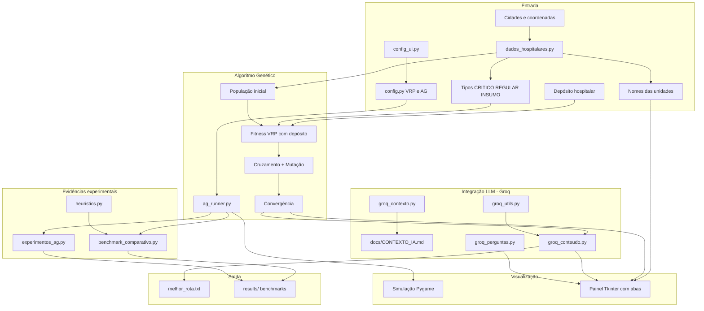

# Documentação — Tech Challenge Fase 2 (Projeto 2)

## Visão geral

Sistema de otimização de rotas para entrega de medicamentos e insumos hospitalares, combinando **Algoritmo Genético (VRP)** com **LLM (Groq)** para relatórios, instruções e chat operacional.

Inclui **depósito hospitalar**, **nomes de unidades**, **tipos de entrega** (CRITICO/REGULAR/INSUMO) e **scripts de evidência experimental**.

## Diagrama de arquitetura

## Fluxo de execução

1. **`config_ui.py`** — entregas, veículos, capacidade (kits), autonomia, CSV opcional.
2. **Resumo dos pedidos** — tabela + `avaliar_viabilidade_frota()`.
3. **`dados_hospitalares.py`** — demandas fixas, CSV ou sorteio (modo aleatório).
4. **`tsp.py`** + **`ag_runner.executar_ag()`** — Pygame (gráfico + mapa).
5. Métricas, divisão por veículo, benchmark VRP (se ≤ 7 cidades).
6. **Groq (LLM)** — uma chamada gera análise, relatórios e instruções (`groq_conteudo.py`); fallback local se API indisponível.
7. **`dashboard_ui.py`** — painel com abas e chat (histórico de conversa).
8. **`melhor_rota.txt`** e **`results/`**.

## Módulos principais

| Arquivo | Responsabilidade |
|---------|------------------|
| `config_ui.py` | Configuração, resumo de pedidos, viabilidade da frota |
| `dados_hospitalares.py` | Nomes, tipos, demandas fixas (kits), CSV, viabilidade |
| `exemplos/pedidos_exemplo.csv` | CSV de exemplo para importar pedidos |
| `genetic_algorithm.py` | AG, fitness VRP, depósito, restrições |
| `ag_runner.py` | Execução do AG reutilizável |
| `heuristics.py` | Heurísticas clássicas de roteamento |
| `benchmark_comparativo.py` | Comparativo AG vs heurísticas |
| `experimentos_ag.py` | 3 experimentos + gráfico de convergência |
| `tsp.py` | Orquestração principal + Pygame |
| `dashboard_ui.py` | Painel com abas e chat |
| `groq_conteudo.py` | Análise + relatórios + instruções em 1 chamada API |
| `groq_contexto.py` | Carrega `docs/CONTEXTO_IA.md` para prompts |
| `groq_utils.py` | Cliente Groq, `.env`, fallback local |
| `groq_perguntas.py` | Chat com histórico de conversa |
| `docs/CONTEXTO_IA.md` | Regras fixas para a IA (VRP, kits, veículos) |
| `groq_*.py` | Fallbacks e módulos legados de prompt |

## Restrições modeladas

- **Depósito:** rotas iniciam e terminam no hospital (`DEPOT`).
- **Prioridade:** medicamentos críticos (tipo CRITICO) devem aparecer cedo na rota.
- **Capacidade:** carga máxima por veículo (kits de medicamentos).
- **Autonomia:** distância máxima por veículo (inclui ida/volta ao depósito).
- **Múltiplos veículos:** alocação evoluída pelo AG.

## Relação com o PDF da Fase 2

| Requisito do PDF | Onde está |
|------------------|-----------|
| AG para roteamento | `genetic_algorithm.py`, `ag_runner.py`, `tsp.py` |
| Restrições realistas | Fitness VRP + tipos de entrega |
| Depósito / contexto hospitalar | `DEPOT`, `dados_hospitalares.py` |
| Comparativo com outras abordagens | `benchmark_comparativo.py` |
| Experimentos com configs do AG | `experimentos_ag.py` |
| Visualização em mapa | Pygame + aba Mapa (H = hospital) |
| LLM instruções e relatórios | `groq_*.py` |
| Chat em linguagem natural | `groq_perguntas.py` |
| Testes automatizados | `tests/test_projeto.py` |
| Documentação / evidências | Este arquivo, `EVIDENCIAS_EXPERIMENTAIS.md` |
