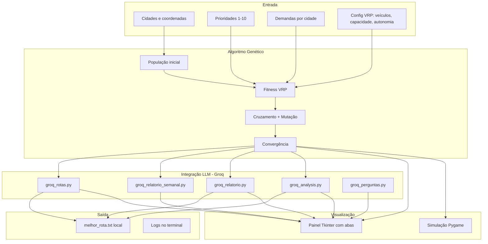

# Documentação — Tech Challenge Fase 2 (Projeto 2)

## Visão geral

Sistema de otimização de rotas para entrega de medicamentos e insumos hospitalares, combinando **Algoritmo Genético (VRP)** com **LLM (Groq)** para relatórios, instruções e chat operacional.

## Diagrama de arquitetura

## Fluxo de execução

1. **`tsp.py`** carrega cidades, prioridades e demandas.
2. **Pygame** abre imediatamente e roda o AG (sem benchmark pesado no início).
3. Ao convergir, calcula benchmark VRP, divide rotas por veículo e gera métricas.
4. **Groq (LLM)** produz análise, relatório diário, instruções de entrega.
5. **`dashboard_ui.py`** abre painel com mapa, veículos, relatórios e chat.
6. Resultados salvos em `melhor_rota.txt` (arquivo local, ignorado pelo Git).

## Módulos principais

| Arquivo | Responsabilidade |
|---------|------------------|
| `genetic_algorithm.py` | AG, fitness VRP, restrições, benchmark |
| `tsp.py` | Orquestração, simulação, pós-processamento |
| `draw_functions.py` | Desenho Pygame |
| `dashboard_ui.py` | Painel com abas e chat |
| `groq_*.py` | Prompts e chamadas à LLM |

## Restrições modeladas

- **Prioridade:** medicamentos críticos devem aparecer cedo na rota global.
- **Capacidade:** carga máxima por veículo (`CAPACIDADE_VEICULO`).
- **Autonomia:** distância máxima por veículo (`DISTANCIA_MAXIMA_VEICULO`).
- **Múltiplos veículos:** rota global repartida entre `NUM_VEICULOS` no fitness.

## Relação com o PDF da Fase 2

| Requisito do PDF | Onde está |
|------------------|-----------|
| AG para roteamento | `genetic_algorithm.py`, `tsp.py` |
| Restrições realistas | Fitness VRP |
| Visualização em mapa | Pygame + aba Mapa |
| LLM instruções | `groq_rotas.py` |
| LLM instruções + relatório diário/semanal | `groq_rotas.py`, `groq_relatorio.py`, `groq_relatorio_semanal.py` |
| LLM melhorias | Seção Recomendações |
| Perguntas naturais | `groq_perguntas.py` + aba Chat |
| Testes automatizados | `tests/` |
| Documentação / diagrama | Este arquivo + README |
