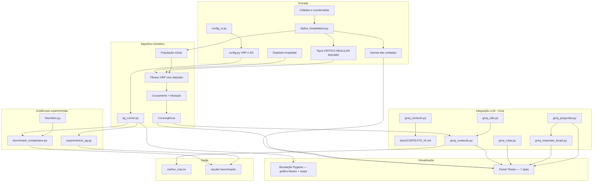

# Documentação — Tech Challenge Fase 2 (Projeto 2)

## Visão geral

Sistema de otimização de rotas para entrega de medicamentos e insumos hospitalares, combinando **Algoritmo Genético (VRP)** com **LLM (Groq)** para análise, relatórios e chat operacional, e **guia local** para motoristas.

Inclui **depósito hospitalar**, **nomes de unidades**, **tipos de entrega** (CRITICO/REGULAR/INSUMO) e **scripts de evidência experimental**.

## Diagrama de arquitetura

## Fluxo de execução

1. **`config_ui.py`** — entregas, veículos, capacidade (kits), autonomia, CSV opcional.
2. **Resumo dos pedidos** — tabela + `avaliar_viabilidade_frota()`.
3. **`dados_hospitalares.py`** — demandas fixas, CSV ou sorteio (modo aleatório).
4. **`tsp.py`** + **`ag_runner.executar_ag()`** — Pygame (gráfico de fitness + mapa).
5. **`priorizar_entregas_capacidade()`** — aplica capacidade da frota; remanescentes no hospital.
6. Métricas, divisão por veículo, benchmark VRP (≤ 6 entregas) + heurísticas na aba Análise.
7. **Groq (LLM)** — uma chamada gera análise e relatórios (`groq_conteudo.py`); fallback local enxuto se API indisponível. O **Guia Motoristas** é montado localmente (`groq_rotas.py`).
8. **`dashboard_ui.py`** — painel com 7 abas; cabeçalho só com o título; convergência só no Pygame.
9. **`melhor_rota.txt`** (rotas + métricas comparativas, sem duplicar blocos) e **`results/`.

## Módulos principais

| Arquivo | Responsabilidade |
|---------|------------------|
| `config_ui.py` | Configuração, resumo de pedidos, viabilidade da frota |
| `dados_hospitalares.py` | Nomes, tipos, demandas (kits), CSV, viabilidade, priorização por capacidade |
| `exemplos/pedidos_exemplo.csv` | CSV de exemplo para importar pedidos |
| `genetic_algorithm.py` | AG, fitness VRP, depósito, restrições |
| `ag_runner.py` | Execução do AG reutilizável |
| `heuristics.py` | Heurísticas clássicas de roteamento |
| `metricas_benchmark.py` | Métricas comparativas (AG, heurísticas, ótimo) — aba Análise e `melhor_rota.txt` |
| `benchmark_comparativo.py` | Comparativo AG vs heurísticas |
| `experimentos_ag.py` | 3 experimentos + gráfico de convergência |
| `tsp.py` | Orquestração principal + Pygame |
| `dashboard_ui.py` | Painel com 7 abas; cabeçalho enxuto (só título); chat com respostas locais ou Groq |
| `groq_conteudo.py` | Análise + relatórios em 1 chamada API (3 seções) |
| `groq_rotas.py` | Guia Motoristas — rota passo a passo montada localmente |
| `groq_contexto.py` | Carrega `docs/CONTEXTO_IA.md` nos prompts Groq |
| `groq_utils.py` | Cliente Groq, `.env`, fallback local |
| `groq_perguntas.py` | Chat com histórico; envia dados estruturados (não cola relatórios inteiros no prompt) |
| `groq_respostas_locais.py` | Chat local: instruções, motorista, carga, kits, follow-up, remanescentes |
| `docs/CONTEXTO_IA.md` | Regras fixas da IA (arquivo operacional, não doc de leitura) |
| `groq_*.py` | Fallbacks locais por módulo (textos enxutos) |
| `tests/fixtures_dados.py` | Cenários reutilizáveis para testes (modo fixo + chat simulado) |
| `tests/README.md` | Guia: modo fixo vs textos simulados |

## Restrições modeladas

- **Depósito:** rotas iniciam e terminam no hospital (`DEPOT`).
- **Prioridade:** medicamentos críticos (tipo CRITICO) devem aparecer cedo na rota.
- **Capacidade:** carga máxima por veículo (kits). Veículos **nunca excedem** capacidade na operação efetiva — kits excedentes ficam no hospital (`priorizar_entregas_capacidade()`).
- **Autonomia:** distância máxima por veículo (inclui ida/volta ao depósito).
- **Múltiplos veículos:** alocação evoluída pelo AG.

## Relação com o PDF da Fase 2

| Requisito do PDF | Onde está |
|------------------|-----------|
| AG para roteamento | `genetic_algorithm.py`, `ag_runner.py`, `tsp.py` |
| Restrições realistas | Fitness VRP + tipos de entrega |
| Depósito / contexto hospitalar | `DEPOT`, `dados_hospitalares.py` |
| Comparativo com outras abordagens | `metricas_benchmark.py` (fluxo principal) + `benchmark_comparativo.py` |
| Experimentos com configs do AG | `experimentos_ag.py` |
| Visualização em mapa | Pygame + aba Mapa (H = hospital) |
| LLM instruções e relatórios | `groq_conteudo.py` (análise/relatórios) + `groq_rotas.py` (guia motoristas) |
| Chat em linguagem natural | `groq_perguntas.py` |
| Testes automatizados | `tests/test_projeto.py` (88) — ver `tests/README.md` |
| Documentação / evidências | Este arquivo, `EVIDENCIAS_EXPERIMENTAIS.md` |
