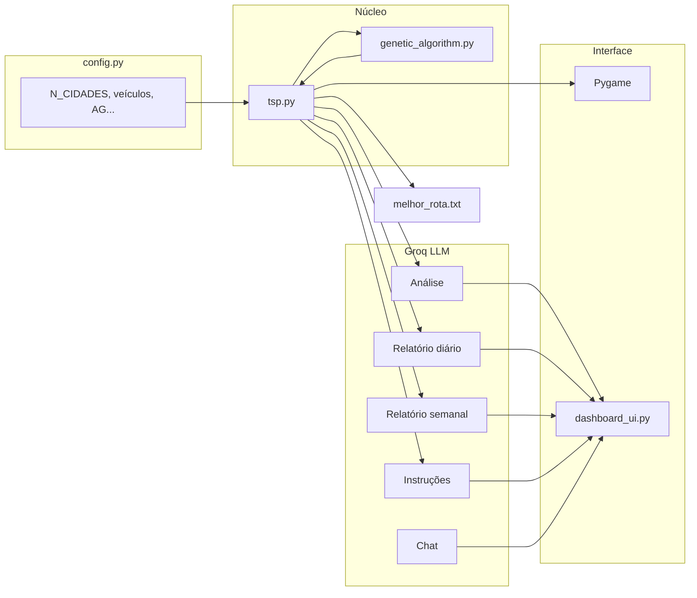

# Visão geral do sistema — Tech Challenge Fase 2 (Projeto 2)

Documento resumido para o grupo entender **como cada parte funciona hoje**.  
Última revisão com base no código atual do repositório.

---

## 1. O que o projeto faz

Sistema de **otimização de rotas hospitalares** (entrega de medicamentos e insumos) que combina:

1. **Algoritmo Genético (AG)** para resolver um **VRP** (Vehicle Routing Problem) com vários veículos
2. **Simulação visual** em tempo real (Pygame)
3. **LLM (Groq — Llama 3.3 70B)** para análise, relatórios, instruções e chat
4. **Painel operacional** (Tkinter) com abas após a simulação

**Entrada:** coordenadas das cidades, prioridade (1–10), demanda por cidade, parâmetros da frota.  
**Saída:** melhor rota + alocação por veículo, métricas, textos da IA, arquivo `melhor_rota.txt`.

---

## 2. Fluxo completo (do início ao fim)

```
config.py  →  tsp.py carrega cidades e dados
                    ↓
              Pygame abre + AG roda geração a geração
                    ↓
              Convergência (ou limite de gerações)
                    ↓
              Benchmark VRP (se ≤ 7 cidades) + métricas finais
                    ↓
              Divisão por veículo + relatórios numéricos
                    ↓
              Groq gera: análise | relatório diário | semanal | instruções
                    ↓
              Salva melhor_rota.txt  →  Abre dashboard_ui.py
```

**Como executar:** `python tsp.py` (requer `.env` com `GROQ_API_KEY` para a parte de IA).  
**Parada da simulação:** tecla **Q** ou fechar a janela Pygame.

---

## 3. Configuração central — `config.py`

**Um único arquivo** concentra os parâmetros do cenário. Para mudar quantidade de cidades, veículos, AG etc., edite só aqui.

| Grupo | Parâmetros principais | O que controlam |
|-------|----------------------|-----------------|
| Problema | `N_CIDADES`, `MODO_CIDADES`, `SEED` | Quantas cidades e de onde vêm |
| VRP | `NUM_VEICULOS`, `CAPACIDADE_VEICULO`, `DISTANCIA_MAXIMA_VEICULO` | Frota e restrições |
| AG | `POPULATION_SIZE`, `N_GENERATIONS`, `MUTATION_PROBABILITY`, `LIMITE_SEM_MELHORA` | Evolução e parada antecipada |
| Cidades | `PRIORIDADE_MIN/MAX`, `DEMANDA_MIN/MAX` | Dados gerados por cidade |
| Interface | `WIDTH`, `HEIGHT`, `FPS`, `PLOT_UPDATE_EVERY` | Janela Pygame |

**Modos de cidades:**

- `MODO_CIDADES = "fixo"` → usa conjuntos pré-definidos em `DEFAULT_PROBLEMS` (**5, 10, 12 ou 15** cidades)
- `MODO_CIDADES = "aleatorio"` → gera `N_CIDADES` coordenadas aleatórias (qualquer número)

Função auxiliar: `obter_cidades()` — chamada pelo `tsp.py` no início.

---

## 4. Núcleo do AG / VRP — `genetic_algorithm.py`

### 4.1 Problema que resolvemos

Não é TSP puro (1 veículo). É **VRP com alocação explícita**:

- **Ordem global** de visita às cidades (`path`)
- **Qual veículo atende cada cidade** (`alocacao`: dict `cidade → índice do veículo`)

Cromossomo = `(path, alocacao)`.

### 4.2 Fitness (quanto menor, melhor)

Soma de:

| Componente | Descrição |
|------------|-----------|
| Distância total | Soma da distância de **cada rota de veículo** (ciclo fechado por veículo) |
| Penalidade de prioridade | Cidades com prioridade alta devem aparecer **cedo** na ordem global |
| Penalidade de carga | Se um veículo excede `CAPACIDADE_VEICULO` |
| Penalidade de autonomia | Se um veículo excede `DISTANCIA_MAXIMA_VEICULO` |
| Penalidade veículo vazio | Se algum veículo não recebe nenhuma cidade |

Constantes de penalidade vêm de `config.py`.

### 4.3 Operadores genéticos

| Operação | Função | O que faz |
|----------|--------|-----------|
| População inicial | `generate_random_population` | Gera `(path aleatório, alocação aleatória)` |
| Crossover | `crossover_vrp` | Order crossover na ordem + crossover uniforme na alocação |
| Mutação | `mutate_individuo` | Troca adjacentes no path + reatribui cidade a outro veículo |
| Reparo | `reparar_alocacao` | Garante que **todo veículo** tenha ao menos 1 cidade |
| Seleção | em `tsp.py` | Elitismo + pais escolhidos por peso inverso ao fitness |

### 4.4 Funções auxiliares importantes

| Função | Uso |
|--------|-----|
| `dividir_rota_em_veiculos(path, alocacao)` | Monta a lista de rotas por veículo (ordem = ordem em `path`) |
| `calcular_distancia_operacao` | Distância total da operação |
| `avaliar_restricoes_veiculos` | Status operacional por veículo (carga, autonomia, viável?) |
| `calcular_solucao_otima_vrp` | Benchmark por força bruta (ordem + melhor alocação) |
| `melhor_alocacao_exaustiva` | Melhor alocação para uma ordem fixa |

**Benchmark exato:** só roda com **≤ 7 cidades** (`LIMITE_CIDADES_BENCHMARK`). Com 10, 12 ou 15 cidades o ótimo aparece como **N/A** (explosão combinatória).

### 4.5 Dados globais por execução

- `city_priorities` — prioridade de cada cidade (preenchido no `tsp.py`)
- `city_demands` — demanda/carga de cada cidade (preenchido no `tsp.py`)

---

## 5. Orquestração principal — `tsp.py`

Arquivo que **liga tudo**. Responsabilidades:

1. **Inicialização**
   - Lê `config.py` e chama `obter_cidades()`
   - Gera prioridades e demandas aleatórias (com `SEED` fixa para reprodutibilidade)
   - Cria população inicial

2. **Loop do AG (Pygame)**
   - Calcula fitness de cada indivíduo
   - Ordena população (melhor primeiro)
   - Desenha cidades + rotas coloridas por veículo
   - Atualiza gráfico de convergência a cada `PLOT_UPDATE_EVERY` gerações
   - Para cedo se **100 gerações** (`LIMITE_SEM_MELHORA`) sem melhoria

3. **Pós-processamento**
   - Extrai melhor `(path, alocacao)`
   - Calcula benchmark VRP (se aplicável)
   - Monta `rotas_veiculos`, `dados_veiculos`, `texto_veiculos`
   - Monta `rota_detalhada` (ordem, coordenadas, prioridade, demanda, **veículo**)
   - Calcula comparativo: AG vs rota aleatória vs ótimo

4. **Integração LLM**
   - Chama os 4 módulos Groq + prepara contexto para o chat

5. **Saída**
   - Grava `melhor_rota.txt`
   - Fecha Pygame e abre `dashboard_ui.py`

---

## 6. Visualização — `draw_functions.py` + Pygame

| Função | Função |
|--------|--------|
| `draw_cities` | Desenha nós (cidades) no mapa |
| `draw_paths` | Desenha arestas da rota de um veículo |
| `create_plot_surface` | Gera gráfico de fitness × geração (matplotlib → surface Pygame) |

Na simulação, cada veículo tem uma **cor diferente** (`CORES_VEICULOS` em `tsp.py`).

---

## 7. Painel operacional — `dashboard_ui.py`

Janela Tkinter com abas, aberta **depois** da simulação:

| Aba | Conteúdo |
|-----|----------|
| Mapa da Rota | Canvas com cidades numeradas (ordem global) e rotas por cor de veículo |
| Veículos | Texto com status de cada veículo |
| Análise | Análise técnica da LLM |
| Relatório Diário | Fechamento operacional do dia |
| Relatório Semanal | Projeção consolidada da semana |
| Instruções | Orientações para motoristas/equipe |
| Convergência | Histórico de fitness por geração |
| Chat | Perguntas em linguagem natural (usa contexto completo) |

O chat roda em **thread separada** para não travar a interface.

---

## 8. Integração LLM (Groq)

Todos usam **Groq API** + modelo **`llama-3.3-70b-versatile`**.  
Chave em `.env`: `GROQ_API_KEY`.

| Arquivo | Papel | Entrada principal | Saída |
|---------|-------|-------------------|-------|
| `groq_analysis.py` | Análise técnica do AG | Métricas numéricas (fitness, melhoria, benchmark, prioridades) | Texto curto (~250 palavras), 5 seções |
| `groq_relatorio.py` | Relatório operacional **diário** | Distância, veículos, prioridades, `texto_veiculos` | Fechamento do dia para gestão |
| `groq_relatorio_semanal.py` | Relatório **semanal** | Resumo projetado (5 dias úteis simulados) + relatório diário como referência | Tendências e recomendações |
| `groq_rotas.py` | Instruções de entrega | Status por veículo | Orientações práticas para equipe de campo |
| `groq_perguntas.py` | Chat | Pergunta do usuário + todo o contexto acima | Resposta em linguagem natural |

**Importante sobre o relatório semanal:** hoje é uma **projeção/simulação** (1 execução × 5 dias), **não** um histórico real de uma semana de operação.

Prompts foram calibrados para:
- Mencionar **múltiplos veículos**
- Não listar todas as cidades
- Ser objetivos (limites de palavras)

---

## 9. Testes — `tests/test_genetic_algorithm.py`

Testes automatizados (`pytest tests/ -v`) cobrem:

- Divisão de rotas com alocação explícita e fallback round-robin
- Geração de alocação (todos os veículos usados)
- Distância e fitness com alocação
- Penalidade por excesso de carga
- Restrições por veículo
- Alocação exaustiva e crossover VRP
- Benchmark omitido com muitas cidades

---

## 10. Outros arquivos (referência)

| Arquivo | Situação |
|---------|----------|
| `demo_crossover.py` / `demo_mutation.py` | Demos didáticos do AG (versão antiga, só ordem) |
| `benchmark_att48.py` | Benchmark clássico ATT48 (48 cidades) — separado do fluxo principal |
| `city_names.py` | Nomes de cidades (não usado no fluxo principal atual) |
| `environment.yml` | Ambiente Conda (`fiap_tsp`) com dependências |
| `docs/ARQUITETURA.md` | Diagrama Mermaid e arquitetura técnica |
| `docs/AVALIACAO_LLM.md` | Critérios de avaliação da qualidade da LLM |
| `melhor_rota.txt` | Gerado localmente a cada execução (no `.gitignore`) |

---

## 11. Restrições modeladas vs. o que ainda não temos

### Implementado hoje

- Múltiplos veículos com **alocação evoluída pelo AG** (não é mais round-robin fixo)
- Prioridade clínica (medicamentos críticos cedo na ordem)
- Capacidade e autonomia **por veículo**
- Convergência antecipada
- Benchmark exato para instâncias pequenas (≤ 7 cidades)

### Limitações conhecidas

- **Sem depósito/hospital fixo** como ponto de saída/retorno (melhoria futura)
- Benchmark exato **N/A** para 10+ cidades
- Relatório semanal é **projeção**, não histórico real
- Demandas e prioridades são **geradas aleatoriamente** a cada execução (com seed fixa)

---

## 12. Diagrama simplificado



---

## 13. Checklist rápido para o grupo

| Pergunta | Onde olhar |
|----------|------------|
| Como mudar número de cidades? | `config.py` → `N_CIDADES` e `MODO_CIDADES` |
| Como funciona o cromossomo? | `genetic_algorithm.py` → `(path, alocacao)` |
| Onde roda o loop do AG? | `tsp.py` → `while running and generation < N_GENERATIONS` |
| Onde vejo rotas por veículo? | Terminal, `melhor_rota.txt`, aba Veículos/Mapa no painel |
| Onde está a IA? | `groq_*.py` |
| Como rodar testes? | `pytest tests/ -v` |
| O que entregar no Git? | Código + docs; **não** commitar `.env` nem `melhor_rota.txt` |

---

*Documento para uso interno da equipe. Para instalação e comandos, ver também o `README.md`.*
